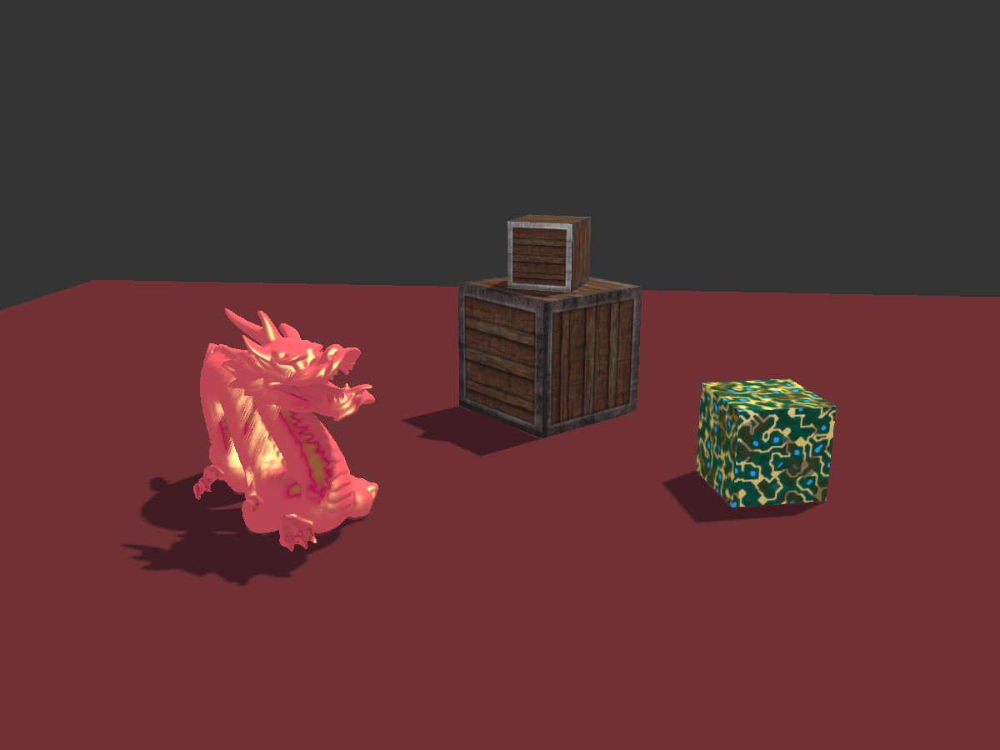
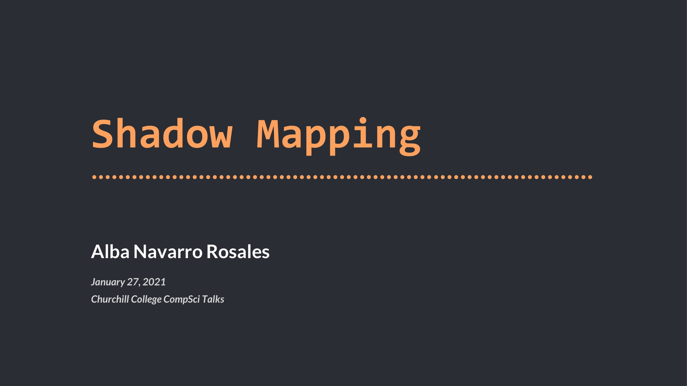

# :mortar_board: Shadow Mapping Tech Talk

Slides and demo code for my Tech Talk _("Shadow Mapping", 27th January 2021)_ in the [Churchill College Computer Science Talks](https://kudos.chu.cam.ac.uk/talks/about) 2020-2021 series. 

For this project, I carried out research about Shadow Mapping in real-time 3D graphics, and produced a 25min talk explaining the technical details and challenges of this method for rendering shadows. Moreover, I did a live demonstration of Shadow Mapping using a renderer I implemented (based on my [OpenGL Renderer in Java](https://github.com/Alba-NR/OpenGL_Java) project). I gave this talk to 40+ computer science students and college fellows via video conference on January 27th, 2021. 

[Video available in the future]

*Left: scene I created, to illustrate the result of implementing (directional) shadow mapping.*
*Right: 1st slide of my talk's presentation.*

**:pushpin: Note:** This repository is set to public to showcase this project; however, this doesn't mean the code, presentation and diagrams can be freely copied and used, please see the [Copyright Notice](#grey_exclamation-copyright-notice) below.

---

## :speech_balloon: Talk Abstract
> _Real-time 3D graphics are a key aspect of many fields nowadays, such as modern computer games. These aim to achieve a level of realism that would not be possible without the  presence of shadows caused by directional and point lights. However, due to the nature of the rendering pipeline, special techniques must be used to be able to render images with shadows._
>
> _In this talk, I will introduce the main technique used nowadays: Shadow Mapping. We will go through the idea behind Shadow Mapping and how it is implemented, discussing the possible artefacts that may occur and how to mitigate them. I will conclude with an interactive demo visualising the different parts of the process._

---
## :mega: About the Churchill College Computer Science Tech Talks
An extract from the [talks' website](https://kudos.chu.cam.ac.uk/talks/about):

> Each week, students, fellows and veteran practitioners deliver presentations on topical, pertinent and pressing issues in Computer Science. The talks are technical in nature and consider implications and opportunities for Computer Science in the modern society. This enables everyone to explore cutting-edge aspects of Computer Science outside the confines of the University lecture syllabus which is set 18 months in advance. Topics are wide-ranging, across both theoretical and practical areas of Computer Science.
> 
> The talks are an essential aspect of personal development for our undergraduates and postgraduates, and bring the Cambridge community together. We develop the crucial skills necessary to master new technologies and apply them in the fast-paced modern world. Speakers use graphics, software demonstrations and prototype hardware to inspire the audience and provoke lively discussion and inform the community.

---
## :open_file_folder: Resources / Bibliography
- Lance Williams, "Casting Curved Shadows on Curved Surfaces", SIGGRAPH 78
- Shadow Mapping Chapter by Joey de Vries, from learnopengl.com
- Shadow Mapping Tutorium CG2 LU by Peter Houska, for TU Wien
- D. Scherzer, M. Wimmer and W. Purgathofer, "A Survey of Real-Time Hard Shadow Mapping Methods", EUROGRAPHICS 2010
- H. Kolivand, M.S. Sunar, A. Altameem, A. Rehman and M. Uddin, "Shadow Mapping Algorithms: Applications and Limitations", 2015
- Shadow Mapping Lecture by Cass Everitt, NVIDIA Corporation
- Custom Shadow Mapping in Unity Medium Article by Shahriar Shahrabi

---

## :grey_exclamation: Copyright Notice

Copyright &copy; 2021 Alba Navarro Rosales. All rights reserved. Please do not copy or modify the design or software in this repository for any purpose other than with the express written permission of the author, neither claim it as your own. Do check [this](https://choosealicense.com/no-permission/) out, thanks! :) 
 :point_up: And remember- plagiarism is bad!
